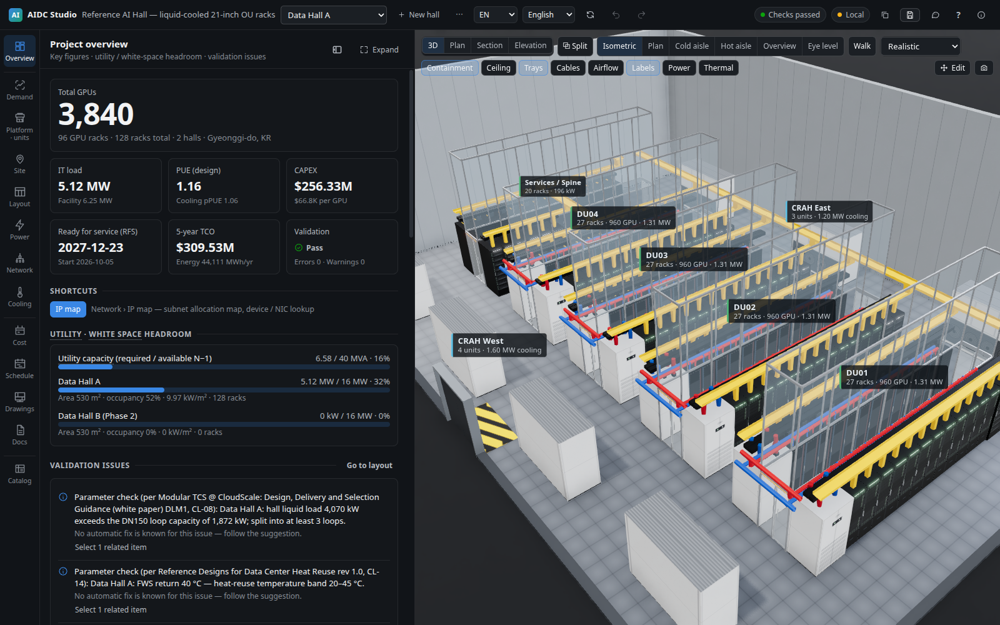
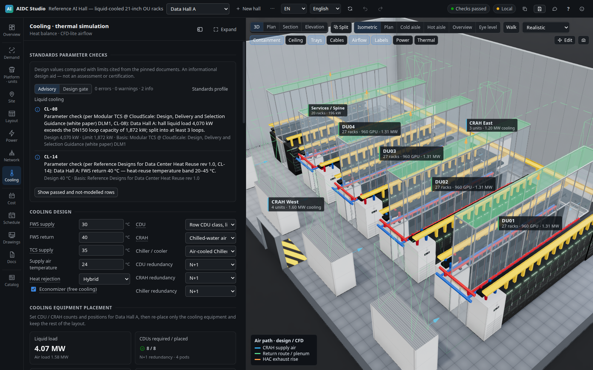
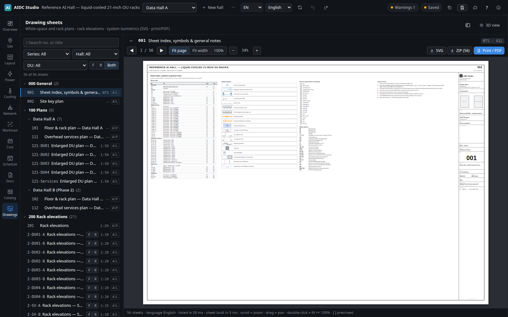

# AIDC Studio

**A vendor-neutral planning and engineering workspace for AI data centres.** AIDC Studio models NVIDIA, AMD, and NPU platforms within one connected system spanning site constraints, compute deployment units, floor layout, power, cooling, networking, workloads, cost, schedule, drawings, and deployment deliverables.

The application is web-first and independent of the host operating system or GPU streaming infrastructure. It does not require vendor asset packs. All published 2D and 3D assets are original, generic parametric representations built from public dimensions.

> AIDC Studio supports early planning, option comparison, and design coordination. Its CFD-lite, power, network, cost, and schedule models do not replace final engineering analysis, authority review, or vendor-certified design.

## Product tour

<p align="center">
  
</p>
<p align="center"><sub>Project KPIs, validation, equipment, and the coordinated hall model remain visible in one workspace.</sub></p>

<table>
  <tr>
    <td width="50%"></td>
    <td width="50%"></td>
  </tr>
  <tr>
    <td align="center"><sub>Explicit supply and return-air design paths, ready to compare with CFD-lite results.</sub></td>
    <td align="center"><sub>Coordinated drawing sets with plans, sections, elevations, isometrics, and system diagrams.</sub></td>
  </tr>
</table>

## What it does

- Builds a site and server-hall model from utility, space, floor-loading, environmental, and availability constraints.
- Converts workload demand into accelerator, deployment-unit, IT-power, cooling, fabric, and floor-space requirements.
- Generates layouts from standard-based templates and registered compute platforms, then fits or right-sizes the hall around the resulting equipment.
- Supports vendor-neutral EIA, OCP Open Rack V3, ORW, rack-scale, RCU, and custom deployment-unit patterns.
- Compares NVIDIA, AMD, and alternative accelerators without treating a vendor reference unit as a universal design unit.
- Sizes power and cooling systems, evaluates redundancy and failure scenarios, and visualises physical service paths in 2D and 3D.
- Generates deterministic IPv4/IPv6 plans, rail-oriented fabric maps, cable schedules, switch inventories, and NOS configurations.
- Runs a browser/Node CFD-lite solver with containment, ceiling-return-plenum, direct room-return, in-row, RDHx, and liquid-to-air comparison cases.
- Produces coordinated plans, sections, elevations, MEP isometrics, one-lines, rack elevations, reports, BOMs, schedules, acceptance-test kits, and deployment bundles.
- Exports JSON, OpenUSD, glTF, Godot, and Unreal integration packages.

## Documentation

- [Product guide](docs/PRODUCT.md) — users, workflow, capabilities, modelling boundaries, and deliverables
- [Architecture](docs/ARCHITECTURE.md) — domain model, engines, geometry, UI/server structure, and design principles
- [Standalone distribution](docs/STANDALONE.md) — single-binary packaging recommendation
- [Export schema](packages/core/src/export/SCHEMA.md)
- [Thermal solver](packages/thermal/README.md)
- [Asset pipeline](tools/asset-pipeline/README.md)
- [Licence](LICENSE) · [Notice](NOTICE) · [Third-party notices](THIRD_PARTY_NOTICES.md) · [Trademarks](TRADEMARKS.md)

## Repository layout

```text
packages/core         Domain model, catalogs, layout generators, analysis engines,
                      documents, drawings, deployment bundles, and exporters
packages/thermal      Browser Web Worker / Node.js airflow and thermal solver
apps/web              React + Three.js application with coordinated 2D/3D views
apps/server           Fastify API for storage, analysis, exports, thermal jobs,
                      collaboration, and static application serving
tools/asset-pipeline  Original parametric USD/GLB model and thumbnail generation
tools/licenses        Dependency notices and publication-boundary auditing
engines/godot         Godot 4 layout viewer
engines/unreal        Unreal Engine 5 Python importer
```

## Core workflow

1. **Select standards and platforms** — Choose a standards profile, deployment-unit template, compatible compute platform, containment, CDU, room-cooling equipment, and network fabric.
2. **Define the site** — Enter climate, power cost, carbon factors, utility feeders, energisation dates, hall envelopes, floor loading, IT-power budgets, and expansion strategy.
3. **Generate and fit the layout** — Place compute and service rows, cooling equipment, electrical rooms, reservations, trays, busways, pipes, and network cores. Fit or right-size the hall in both directions.
4. **Model workloads against the placed cluster** — The dominant placed accelerator supplies the physical HBM, usable-memory limit, scale-up domain, compute and bandwidth envelope. Estimate training or inference throughput, communication overhead, MFU, goodput, duration, replica demand and power profile. Inference first derives a memory-fit TP floor from weight and one-sequence KV residency, then uses request rate to size replica count. Replicas support TP/PP/EP/CP, including independent prefill and decode topologies for P/D disaggregation. Calibrate throughput and latency with measured benchmark data when available.
5. **Analyse infrastructure** — Review capacity, redundancy, power paths, cooling balance, CFD-lite results, cable reach, rail utilisation, IP allocation, validation findings, and one-click remedies.
6. **Plan delivery** — Evaluate BOM, CAPEX/OPEX/TCO, procurement lead times, installation waves, commissioning, and the critical path.
7. **Issue deliverables** — Generate reports, drawings, rack plans, cable/IP schedules, NOS configurations, test packs, and model exports.

The default UI is cluster-first: platform and deployment units → site → layout → workload simulation. A separate workload-to-GPU/DU resize what-if remains available for greenfield demand-first studies; it creates a proposal and does not silently replace the placed hardware basis.

## Key modelling concepts

### Catalog, compute platform, template, and deployment unit

- A **catalog item** describes a reusable component or system class with dimensions, capacity, power, cooling, cost, provenance, and standards metadata.
- A **compute platform** describes the deployable server or rack-scale compute system.
- A **layout template** defines physical interfaces and eligible compute slots. It lists only platforms registered as compatible with those slots.
- A **deployment unit (DU)** is the generated, project-specific group of compute and support equipment placed in a hall.
- A vendor **scalable unit (SU)** or reference architecture remains a vendor-specific planning unit. It is not assumed to be interchangeable across vendors.

### Standards-based design

Projects can use standard profiles based on EIA and OCP interfaces. The standards registry records identifiers, revisions, public sources, status, and applicability without copying standards documents. Parameter checks cover rack mechanics, rack power, liquid and air cooling, networking, and facility prerequisites. These checks are design aids, not certification.

### Shared geometry

The 3D viewer, interactive 2D views, drawing sheets, clash/wall audits, and exporters derive from the same hall primitives. Plans, sections, elevations, busways, cable trays, power paths, containment, penetrations, and TCS pipes therefore remain coordinated as the layout changes.

### Network and IP planning

The network model supports scale-up and scale-out fabrics, rail-optimised and conventional topologies, per-port cable schedules, tray-aware length estimation, load-balancing efficiency, measured calibration, and selectable training or inference traffic scenarios. Inference evaluation combines the GPU racks placed in the layout with prefill/decode TP/PP/EP/CP topology and P/D KV-cache transfer demand to expose tier bottlenecks. The IP planner produces IPv4 and IPv6 addressing, ASN allocation, subnet utilisation, device/NIC assignments, overlap checks, and printable/CSV outputs.

### Cooling and CFD-lite

Cooling analysis combines liquid and air heat balance, CDU/CRAH/chiller sizing, pPUE/WUE, containment, and a lightweight 3D solver. The selected hot-air return path is explicit:

- **Common ceiling return plenum:** HAC exhaust rises into the shared plenum and enters each CRAH through a top return riser.
- **Direct room-top return:** the ceiling plenum is excluded and CRAHs draw from the upper room.

The 3D airflow overlay shows design intent before a simulation and combines it with CFD particles after a run. Final mechanical design must be checked with project-specific engineering and higher-fidelity CFD where required.

### Drawings and documents

The drawing set includes an index and legend, site key plan, coordinated floor and overhead-services plans, enlarged DU plans, transverse and longitudinal sections, containment elevations, MEP pipe isometrics, row schematics, rack elevations, and hall power one-lines. Output supports English/Korean content and metric or ft-in units.

## Quick start

Requirements:

- Node.js 20 or later; Node.js 24 is recommended.
- Python 3.10 or later only when regenerating parametric assets.

```bash
npm install

# Development: API server on 8787 and web app on 5173 with /api proxying
npm run server          # terminal 1
npm run dev             # terminal 2 -> http://localhost:5173

# Single-server operation
npm run build
npm run server          # -> http://localhost:8787
```

Optional asset regeneration:

```bash
python3 -m venv tools/asset-pipeline/.venv
tools/asset-pipeline/.venv/bin/pip install -r tools/asset-pipeline/requirements.txt
tools/asset-pipeline/.venv/bin/python tools/asset-pipeline/build_all.py
```

Docker uses a two-stage build and installs only production server dependencies in the runtime image:

```bash
docker compose up --build   # -> http://localhost:8787
```

## Verification

```bash
npm test
npm run typecheck
npm run build
node tools/licenses/check-publication.mjs
```

The publication audit prevents private project data, research captures, local dependencies, and vendor-derived source assets from entering the published file set.

## Local LLM assistant

The assistant uses the glossary, page help, current-screen context, and a compact analysis summary. It works with an OpenAI-compatible local endpoint such as vLLM and falls back to deterministic glossary answers when no model is available. It has no tools and cannot modify a project.

```bash
vllm serve <model-id> \
  --host 127.0.0.1 --port 8001 \
  --max-model-len 32768 --gpu-memory-utilization 0.85

LLM_BASE_URL=http://127.0.0.1:8001/v1 \
LLM_MODEL=<model-id> \
PORT=8787 npm run server
```

| Variable | Purpose |
|---|---|
| `LLM_BASE_URL` | OpenAI-compatible base URL ending in `/v1` |
| `LLM_MODEL` | Model ID; when empty, the first result from `GET /v1/models` is used |
| `LLM_API_KEY` | Optional bearer token, retained by the server |
| `AIDC_SHARED_SECRET` | Optional secret required for LAN API requests except `/api/health` |

Project text is treated as untrusted context. Page context is sent only when **Include current screen** is enabled, and the UI warns before using an endpoint outside loopback or the local network.

## Collaboration

The built-in collaboration model is intended for a small trusted LAN and does not provide user accounts or role-based access control.

- Per-project advisory edit lock with a 120-second TTL and 40-second heartbeat
- Named and automatic versions, with the most recent 50 retained
- KPI and equipment comparison between versions
- Conflict-copy preservation for stale `If-Match` saves
- Shareable project/page/hall links
- Optional `AIDC_SHARED_SECRET` for the API

## Third-party content and provenance

- Vendor names and public specifications are used to identify compatible products. Values are tagged as `public-spec`, `announced`, `derived`, `estimate`, or `unverified` as applicable.
- Product names and trademarks belong to their respective owners. AIDC Studio is not affiliated with or endorsed by them. See [TRADEMARKS.md](TRADEMARKS.md).
- Published 3D models, USD files, thumbnails, and textures under `apps/web/public/assets` were created for AIDC Studio. The credited sky environment map is derived from [Poly Haven](https://polyhaven.com/a/autumn_field_puresky) content released under CC0 1.0; exact attribution is in `apps/web/public/assets/CREDITS.json`.
- The repository contains no vendor-supplied 3D models, CFD data, logos, product photographs, HMI graphics, slides, manuals, or videos.
- Research notes under `docs/research/`, legal-audit working papers under `docs/legal/`, live project data under `data/`, and private source assets under `assets/` are excluded by `.gitignore`.
- Dependency copyrights and licence texts are collected in [THIRD_PARTY_NOTICES.md](THIRD_PARTY_NOTICES.md) and the web application's bundled notice file.

## Licence

AIDC Studio is distributed under the [MIT License](LICENSE). You may use, modify, merge, publish, distribute, sublicense, and sell copies, including commercially. Copies or substantial portions must retain the copyright and licence notice. The software is provided “as is,” without warranty. The licence does not grant rights to the AIDC Studio name or logo; see [TRADEMARKS.md](TRADEMARKS.md).

Copyright 2026 haanjack
