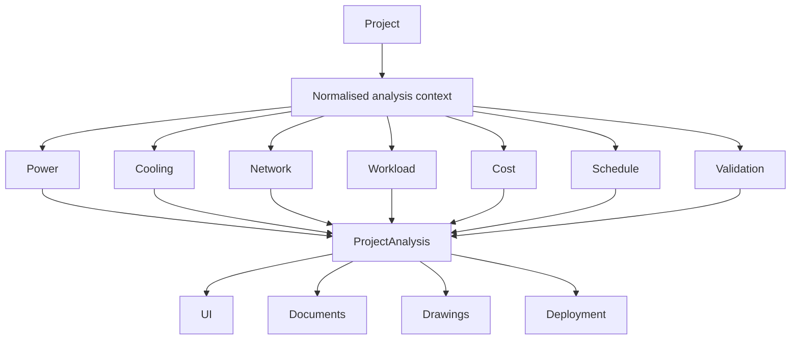

# AIDC Studio Architecture

## System context

AIDC Studio uses one project model across the browser, Node.js server, workers, tests, document generators, and exporters.

```mermaid
flowchart LR
  subgraph Browser
    UI[React application] --> Store[Zustand project store]
    Store --> Core[@aidc/core]
    Store --> Workers[Layout, drawing, document, and thermal workers]
    UI --> Viewer[Three.js 3D viewer]
    UI --> View2D[Canvas/SVG 2D viewer]
  end

  subgraph Server
    API[Fastify API] --> Storage[Projects, versions, settings]
    API --> Jobs[Analysis, thermal, and export jobs]
    API --> LLM[Optional local-LLM proxy]
  end

  subgraph OfflineBuild
    Assets[Parametric asset pipeline] --> PublishedAssets[Generic GLB, USD, thumbnails]
  end

  Store <--> API
  Core --> Documents[Reports, drawings, deployment bundles]
  Core --> Exports[JSON, USD, Godot, Unreal]
  PublishedAssets --> Viewer
```

## Design principles

### One domain model

`packages/core/src/model/types.ts` defines the shared `Project` model. Analysis engines consume a project and return derived results without maintaining a second authoritative model. Coordinates use metres; plan data uses X/Y and 3D output uses Z as height.

### Pure deterministic analysis

Core calculations are designed as pure TypeScript functions so they behave consistently in the browser, server, tests, workers, and export paths. Identical input should produce identical analysis and document output.

### One geometry source

`packages/core/src/scene` builds hall primitives for equipment, containment, walls, doors, slabs, ceilings, columns, trays, busways, power paths, pipes, lighting, and penetrations. Projection modules convert those primitives into plan, section, and elevation views. The same primitives feed the 3D viewer, 2D view, drawings, and geometry audits.

### Explicit provenance and uncertainty

Catalog and standards values carry source type, status, and citation metadata. Announced, estimated, derived, and unverified values remain visibly distinct from published specifications.

### Vendor-neutral core, vendor-specific data

Engines operate on capabilities, interfaces, and declared topology rather than vendor IDs. Vendor products may appear in catalog seeds or sample projects, but fallbacks and engine rules must use neutral classes or standards metadata.

### Optional advanced runtimes

The browser and Node.js are sufficient for normal use. OpenUSD, Godot, Unreal, local LLMs, and high-end rendering are optional downstream runtimes rather than product dependencies.

## Packages

### `packages/core`

The core package contains:

- project types, upgrades, coordinate geometry, and aliases;
- built-in and extensible catalog registries;
- standards registry, profiles, parameter checks, and provenance;
- deployment-unit templates, platform-slot eligibility, layout generation, fit-to-space, right-size, reservations, and cooling placement;
- power, cooling, network, traffic, workload, cost, schedule, validation, and facility-precheck engines;
- cable, IP/ASN, NOS, rack-plan, inventory, and acceptance-test outputs;
- scene primitives and 2D projection;
- drawing sheets and printable HTML design documents;
- project, layout, USD, Godot, and Unreal exporters;
- glossary, page help, assistant retrieval context, and version comparison.

### `packages/thermal`

The thermal package contains the shared CFD-lite implementation:

- case construction and voxelisation;
- rack heat/inlet/exhaust boundaries;
- room-cooler supply and return boundaries;
- containment walls, roofs, doors, chimneys, and ceiling openings;
- optional return-plenum domain;
- in-row, RDHx, and liquid-to-air comparison variants;
- pressure projection, multigrid support, transport, convergence, snapshots, and zone statistics.

The browser runs it in a Web Worker. The server can run the same solver for server-side jobs.

### `apps/web`

The web application provides:

- the project store with undo/redo and autosave;
- workflow panels and bilingual UI dictionaries;
- asynchronous workers for expensive layout, thermal, drawing, and document work;
- a Three.js/R3F viewer with instancing, selection, multi-move, orbit/fly controls, physical service overlays, thermal fields, and airflow;
- a coordinated 2D runtime with plan, section, elevation, split view, layers, measurement, and export;
- reports, drawings, project administration, collaboration, help, standards, and local-LLM controls.

### `apps/server`

The Fastify server provides:

- project CRUD and filesystem-backed persistence;
- optimistic saves through `If-Match`;
- advisory project locks and heartbeats;
- automatic and named versions plus comparison/restore;
- server catalog storage;
- project analysis, export ZIPs, drawings, and thermal jobs;
- local-LLM settings and streaming proxy;
- static serving of the built web application.

## Project hierarchy

```text
Project
├── Site and utility feeders
├── Halls
│   ├── layout policy and standards override
│   ├── equipment instances
│   ├── containment and reservations
│   ├── trays, busways, pipes, rooms, and penetrations
│   └── optional thermal snapshots
├── Catalog extensions
├── Template registry extensions
├── Network clusters and fabrics
├── Workload blueprints
├── Deployment waves
└── Cost, schedule, document, and drawing settings
```

Catalog definitions are reusable descriptions. Equipment instances hold project placement and operational overrides. Analysis results are derived and are not the authoritative source for editable design data.

## Template and platform model

A layout template declares one or more compute slots. Each slot defines a role, eligible catalog IDs, default platform, and count or ratio per deployment unit. Eligibility is evaluated from the template registry and standards/interface constraints.

This separates four concepts that must not be conflated:

- component catalog;
- compute platform;
- physical deployment template;
- vendor reference or scalable unit.

Fit-to-space enumerates registered template/platform combinations only. A custom template is the correct extension mechanism for mixed accelerators or project-specific ratios.

## Analysis flow



The UI recalculates inexpensive analysis after project edits. Expensive fit, thermal, drawing, and document operations run outside the main browser thread.

## Physical systems

### Power

Power paths connect utility, generator, UPS, distribution, RPP/busway, tap-off, and equipment load. Geometry and electrical analysis share circuit identifiers so one-lines, failure scenarios, and 3D highlights can refer to the same logical path.

### Cooling

The model separates facility water, technology cooling system, liquid capture, and room-air heat. Placement options determine physical units; capacity analysis determines whether they are sufficient; CFD-lite evaluates the selected air boundary conditions.

Ceiling-plenum return and direct room-top return are explicit thermal options. The viewer receives the same option so the displayed design path and solved case cannot silently disagree.

### Network

Network analysis is per declared cluster. Independent halls receive independent fabrics; joined clusters add inter-hall cores and trunks. Cable runs use physical endpoints and, where possible, the tray graph. Traffic overlays derive from workload demand and effective fabric efficiency.

### IP and operations

IP planning is deterministic and stable for a project topology. It supports IPv4 and IPv6, subnet hierarchy, ASN allocation, device interfaces, utilisation, and overlap findings. The same data feeds UI maps, HTML/CSV documents, inventory, and NOS templates.

## Documents and drawings

Document generation follows the engineering workflow rather than the UI implementation order. The design report covers design basis, space, compute architecture, layout, cooling, network and IP, control/storage, power, resilience, BOM, schedule, deployment, and acceptance.

Drawing sheets are generated independently and lazily. Sheet IDs are stable so the UI can retain selection while filters or locale change. Drawing units and document locale belong to the project.

## Collaboration and persistence

The server stores projects as JSON and versions as snapshots. An advisory lock reduces concurrent-edit conflicts but is not an authentication mechanism. Optimistic concurrency protects writes:

- current save: accepted and versioned;
- stale `If-Match`: `412`, conflict copy retained, latest server copy returned;
- lock held by another editor: `423`;
- force release: current server state is preserved before lock transfer.

Private deployments should bind to loopback or a trusted LAN and use `AIDC_SHARED_SECRET` when other hosts can reach the API.

## Security model

- Project strings are untrusted when included in LLM context.
- The browser does not send prompts directly to an LLM endpoint.
- LLM keys remain server-side.
- The assistant has no tools or write actions.
- File exports use allowlists and generated content.
- Uploaded catalog images are size- and type-validated.
- Publication rules exclude live data, research captures, vendor source assets, local environments, and build output.

This is not a multi-tenant security boundary. Account management, role-based access, audit identity, and internet-facing hardening require an external deployment layer.

## Testing strategy

The repository includes:

- unit tests for geometry, capacity, traffic, workload, schedules, standards, and exports;
- layout sweeps across templates, platforms, counts, orientations, and hall constraints;
- invariants for port conservation, capacity, overlap, wall penetration, and path continuity;
- deterministic drawing and reference-project goldens;
- thermal case and regression tests;
- server API, persistence, lock, conflict, and security tests;
- public-asset, provenance, terminology, and publication-boundary guards;
- build and TypeScript checks.

## Extension points

- Project catalog extensions add components without changing the built-in registry.
- Server catalog libraries share approved catalog items across projects.
- Template registry extensions add project-specific physical patterns and eligible platforms.
- Standards profiles and checks can be extended from public revisions.
- Exporters consume the shared model and scene primitives.
- Workload presets and benchmark calibrations add demand models without changing layout logic.

Extensions should preserve deterministic IDs, explicit provenance, and neutral engine behaviour.
