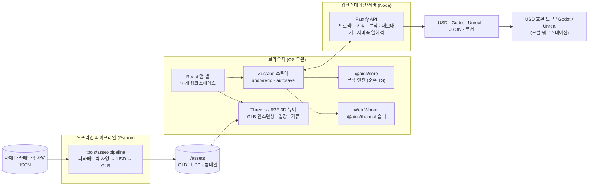

# AIDC Studio 기획서

> 2026-09-15 중립화: AIDC Studio는 특정 벤더 콘텐츠 팩에 의존하지 않는 벤더 중립 도구입니다. 벤더 자료를 전사·인용한 조사 노트와 스크린샷은 비공개 보관소로 옮겼고, `docs/research/`는 기본 비공개입니다. 요약: `docs/research/neutral-N3.md`, 라이선스: `NOTICE` · `THIRD_PARTY_NOTICES.md` · `TRADEMARKS.md`.

> AI 데이터센터(AI Factory)를 **하나의 시스템**으로 보고 기획 → 설계 → 실험(시뮬레이션) → 구현(도입·설치) 까지 한 도구에서 다루기 위한 컨설팅용 소프트웨어.
> 특정 벤더(NVIDIA·AMD·NPU 플랫폼 모두 지원), OS, GPU 스트리밍 인프라에 종속되지 않는 **웹 퍼스트** 구조를 택했다.

## 1. 문제 정의

| 기존 방식 | 문제 |
|---|---|
| 전력(ETAP 등), CFD(6SigmaDCX·Cadence), 네트워크(스프레드시트), 일정(MS Project)이 각각 분리 | 한 가지 변경(예: GB200→GB300, IB→RoCE)이 전력·냉각·케이블·비용·일정에 미치는 영향을 즉시 볼 수 없음 |
| 고품질 디지털 트윈 플랫폼은 대개 워크스테이션급 GPU와 스트리밍 인프라가 필요 | 고객사 미팅·초기 컨설팅 단계에서 가볍게 돌리기 어려움 |
| 벤더 사양·가격·리드타임의 출처가 섞여 있음 | 어떤 숫자를 믿어야 하는지 추적 불가 |

**목표**: 상면(화이트 스페이스)과 수전 조건을 입력하면 → 레퍼런스 설계 규칙 기반 배치 → 전력/냉각/네트워크/비용/일정/워크로드가 자동으로 연동 분석되고 → 3D로 장단점을 확인하고 → USD/Godot/Unreal로 내보내 고품질 시각화까지 이어지는 흐름.

## 2. 사용자와 시나리오

| 페르소나 | 핵심 질문 | 사용하는 화면 |
|---|---|---|
| 인프라 컨설턴트 | "이 부지·수전 조건에 GB300 몇 랙까지 들어가나? 언제 가동되나?" | 사이트·수전 → 배치 → 개요 → 일정 |
| 네트워크 아키텍트 | "IB XDR vs Spectrum-X vs 범용 RoCE, 비용 대비 학습 시간 차이는?" | 네트워크 (비교 뷰) → 워크로드 |
| 기계/전기 엔지니어 | "HAC 없으면 흡기 온도가 몇 도까지? UPS 이중화 방식별 수량은?" | 냉각·열 (CFD-lite, 시나리오 비교) → 전력 |
| 사업/재무 | "CAPEX·TCO, GPU당 비용, 단가 바뀌면?" | 비용 (단가 오버라이드) |
| 발주처 보고 | "기술 설계서와 3D 렌더" | 문서·내보내기 (Markdown, USD, glTF, 스크린샷) |

## 3. 기능 범위 (구현 현황)

| 영역 | 기능 | 상태 |
|---|---|---|
| 사이트·수전 | 기후, 전력 단가·탄소계수, 수전 피더(용량·변전소·공급 개시일), 필요 vs 가용 MVA | ✅ |
| 상면 | 홀 치수·천장고·플레넘·바닥하중·IT/냉각 예산, 장애물(keepout), 활용률·밀도·하중 검증, **홀 추가·이름 변경·복제(빈 홀 / 배치 포함)·삭제**(상단 바 홀 메뉴 · 사이트 패널; 삭제 시 장비·컨테인먼트·트레이·버스웨이·예약·서비스 구역·클러스터 소속·웨이브 포드·열 해석 결과 정리, Ctrl+Z 되돌리기, 마지막 홀 삭제 불가 — `layout/halls.ts`) | ✅ v2 2차 후속 |
| 배치 | 랙 스케일 Deployment Unit 생성기(2열×12랙, 0.6 m 피치, HAC), CDU/네트워크 랙 자동 수량, 서비스 열, 페리미터 CRAH, 드래그 편집, 복제/회전/웨이브 지정 | ✅ |
| 전력 | IT/네트워크/기계/손실 → PUE, UPS/발전기/변압기/RPP 이중화별 수량, 단선 결선도 | ✅ |
| 냉각·열 | 액체/공기 열수지, CDU/CRAH/칠러 사이징, pPUE·WUE, **3D 기류·열 솔버(웹 워커)**, 랙 흡기 온도·RCI·RTI·SHI, 시나리오 비교. 벤더 CFD 결과 오버레이와 벤더 레퍼런스 POD 프로젝트는 2026-09-15 중립화에서 제품·저장소에서 제거 | ✅ |
| 네트워크 | Rail-optimized/Fat-tree 2·3-tier 사이징, 프론트엔드·스토리지·OOB, 랙 위치 기반 케이블 길이·종류 자동 선정(DAC/AEC/AOC/MMF/SMF), 케이블·트랜시버 BOM, **IB vs RoCE 비교** | ✅ |
| 워크로드 | 블루프린트(JSON) 기반 학습/파인튜닝/추론 시뮬레이션: 스텝 시간(연산/통신), MFU, goodput(고장·체크포인트), 학습 기간, 추론 GPU 수, 전력 프로파일 | ✅ |
| 비용 | BOM(IT·네트워크·케이블·전력·냉각·시설·인건비·예비비), CAPEX/OPEX/TCO, 단가 오버라이드, KRW/USD | ✅ |
| 일정 | 조달 리드타임, 수전 에너자이징 제약, 웨이브별 설치·케이블링·L1–L5 커미셔닝, 크리티컬 패스, GPU 가동 램프 | ✅ |
| 문서 | 한국어 기술 설계서 자동 생성(mermaid 결선도·토폴로지·간트 포함), 설계 노트 | ✅ |
| 내보내기 | OpenUSD(자체 생성 USD 페이로드, 없으면 `aidc:*` 속성 박스), Godot 4 프로젝트, Unreal 5 임포트 스크립트, 엔진 중립 layout.json, glTF, 프로젝트 JSON | ✅ |
| 배포 | 단일 Node 서버(웹+API), Docker/compose, 오프라인(브라우저 저장) 모드 | ✅ |
| **배치 v2** (S1) | 표준 물리 인터페이스 템플릿(ORv3 HPR·ORW·EIA air/liquid), 인용된 NVIDIA 시설 SU(Compute HAC + Support HAC), 범용 rack-scale/RCU/custom DU, 모든 패브릭의 중앙 랙(스파인/코어/FE/스토리지/OOB) 자동 산정·행 래핑, 지원 HAC, 냉각 엔진 기반 CRAH 수량(W/E → N/S → 열단), 포드 컬럼·방향, 스파인 위치 4종, 트레이·버스웨이 폴리라인(`project.trays/busways`), 홀 자동 크기 / **상면 맞춤(fit-to-space, 워커)**, 부족분 거부 토스트 | ✅ v2 1차 |
| **네트워크 v2** (S2) | 워크로드→트래픽 엔진(TP/PP/CP/DP/EP 바이트, 계층 부하, η 로드밸런싱 클래스, 최소 오버서브, L2/L3), `commEfficiencyEffective`가 학습 시간에 반영, **스파인/코어 배치 비교기**(central-end/center/distributed/separate-room — S1 재배치 엔진 기반), 트레이 그래프 케이블 길이(힙 Dijkstra), DriveNets FSE(DDC) · ESE+UEC · 범용 RoCE 800G 패브릭, ToR/mid-row/end-of-row 리프 배치, 규모 산정 박스(워크로드 → GPU/DU/MW/m² → 배치 패널 프리필) | ✅ v2 1차 |
| **카탈로그 v2** (S3) | 레지스트리(내장 ∪ 서버 라이브러리 ∪ 프로젝트 확장), 시드 72종(NVIDIA HGX H100/H200/B300 · VR NVL72 · SN6600/6800, AMD MI300X/MI325X/MI350X/MI355X 노드·랙, NPU 8사, 800G 스위치 11종, NIC 5종, 케이블 8종, CDU 4종), 노드→랙 컴포저(U-map), 카탈로그 패널(편집·복제·JSON·서버 라이브러리 PUT) | ✅ v2 1차 |
| **경험·문서 v2** (S4) | 용어집 170항(EN/KO) + `<Term>` 팝오버 + 도움말 드로어, 3D orbit 수평 WASD 및 fly 카메라(WASD, 눈높이 프리셋), Shift/Ctrl/⌘ 다중 선택·일괄 이동, 설계서 11장 EN/KO(영어 기본), 배포 번들(웨이브별 BOM · 랙 플랜 CSV/MD), Apache-2.0 + NOTICE | ✅ v2 1차 |
| **도면·Helios** (S5) | A1 SVG 시트: 100 평면 블루프린트(그리드 버블·치수선·태그), 200 랙 입면(U-map), 400 시스템 분해 등각(단계별 운전 매트릭스), 미리보기·다운로드·ZIP·인쇄(PDF); AMD Helios 파라메트릭 USD/GLB + 카탈로그 항목(`announced`) | ✅ v2 1차 |
| **배치 · 냉각 배치 v2 2차** (T1) | 서비스 **구역**(끝 띠 / 중앙 띠 / DU별 서포트 HAC / 별실) + 예비·증설 자리(`project.reservations`), 방향·컬럼 자동 선택(면적 최소 → 종횡비 ≤ 2:1), grow-only와 **양방향 right-size**(레이아웃 변경 시 상면 확대·축소), `regenerateCooling`(포드당 CDU·열 끝/끝+중앙/기계 갤러리·CRAH 전략/벽), CDU 2차 루프 80/60 m 예산, 홀 간 코어 예약(조인 클러스터), 통로를 따르는 조명 | ✅ v2 2차 |
| **네트워크 v2 2차** (T2) | 클러스터 범위(기본 홀별 독립 패브릭, 명시적 조인 시 슈퍼 스파인 + SMF 트렁크), 출처 있는 η(η_host × η_fabric) + nccl-tests/rccl-tests 로그 붙여넣기 보정, 겹침 식 T_nic − min(f·T_nic, W), η 민감도 차트, 포트 단위 케이블 스케줄(TIA-606 형식 참고 라벨·BSN), IP/ASN 플랜(/31 · BGP unnumbered · RFC 6996/7938), **IP 맵**(네트워크 › IP 맵 탭 · 개요 바로가기: 사이트 /8 → 블록 → 홀 → 패브릭·역할 → 포드 → 서브넷 중첩 블록 지도, CIDR·사용률, 장치·NIC·IP 조회 강조 — `engines/ipmap.ts`) | ✅ v2 2차 |
| **전력 플레인** (T3) | 3D 전력 경로(버스웨이 A/B·탭오프·RPP·피더) 오버레이, 시나리오(유틸리티 상실·발전기·UPS 모듈·RPP·버스웨이 고장·부하 %), N-1 스윕, Max-Q, IEC/NEC 프로필, 단선도 ↔ 3D 연동 | ✅ v2 2차 |
| **냉각 비교** (T4) | 냉각 패널 "냉각 설비 배치"(F8) + 이슈 목록의 "냉각 설비 배치로 이동", 5개 방식(갤러리 팬월·둘레 CRAH·in-row·사이드카 L2A·RDHx) 결정론적 비교표, CFD-lite 변형(RDHx 문·in-row·사이드카) 워커 비교 | ✅ v2 2차 |
| **카탈로그 UX** (T5) | 렌더링 썸네일 / 정면 도식(SVG) / 사용자 이미지(≤ 1 MB, 서버·프로젝트 저장 모두 검증), 랙 blueprint 컴포저(42U/48U/ORW 44 OU), 저장 위치 안내 + "배치에 추가 / 생성기에서 사용", 패널 접기(Ctrl+Shift+L), 정밀도별 MFU 기준(피크 TFLOPS 표) | ✅ v2 2차 |
| **워크로드 UX** (T6) | 필드별 설명·영향 태그, GPU 비중 합계 미터(초과 시 비례 축소 + 경고, 정규화 / 가져오기), 공개 config 기반 모델 프리셋, 벤치마크 보정(MLPerf 등 → 유효 TFLOP/s · MFU 역산), head_dim·어텐션 윈도·dense/MoE 레이어를 트래픽 바이트에 반영 | ✅ v2 2차 |
| **산출물 v2 2차** (T7) | 설계서 HTML(인쇄용 단일 파일, 내장 SVG 결선도·토폴로지·간트·도면), BOM·랙 플랜·케이블 스케줄·IP 플랜·스위치 인벤토리 HTML + CSV, NOS 설정 7종(SONiC · Cumulus NVUE · EOS · NX-OS · Dell Enterprise SONiC · Junos · IB UFM/OpenSM), 인수 시험 키트(η 측정 키트·노드·스토리지·전력/열, pytest) — 생성은 웹 워커 | ✅ v2 2차 |
| **플랫폼** (T8) | UI 언어 EN/KO(타입 사전, 네임스페이스별), 로컬 vLLM Q&A(용어집·현재 분석 근거, 인용 검증, LLM 없으면 용어집 폴백), 협업(링크 공유 · 버전 50개 + 두 버전 분석 비교 · 표시 이름 기반 편집 락 · 412/423) | ✅ v2 2차 |
| **벽 관통 감사 · 전력 피더 경로** (D1, finish) | 모든 선형 요소(트레이·버스웨이·회로·피더·케이블·조명·칸막이)를 순수 형상으로 검사하는 코어 감사기 `layout/wallAudit.ts` + 스윕 테스트(12개 구성 + F9 기둥·당시의 벤더 레퍼런스 POD), `WallPenetration`(피더·트렁크·칸막이/굴뚝 슬리브, `analysis.power/network.penetrations`), 피더는 버스웨이 중앙선 상승 → 트레이·장비 상단 +0.3 m 위 접근 → 끝 통로 피더 트레이(0.1 m 슬롯·층, 교차·중첩 없음) → 기둥·굴뚝 없는 레인 → 전기실당 슬리브 1개(`engines/powerGeometry.ts`), 별실 칸막이 천장까지·양 벽 닫힘, Y 방향 홀 케이블 표시(`layout/geometry3d.ts`), 묶인 홀 트렁크 슬리브 + 사이트 경로(길이 모델 공용, `layout/trunkSleeves.ts`), 홀 겹침 오류·홀 간 전기실 겹침 표시. QA 체커 21개 구성에서 피더 위반 2,418 → 0 (`docs/research/finish-geometry-racks-v2-2.md`) | ✅ v2 2차 finish |
| **랙 입면도** (D2) | DU·서비스·네트워크 코어 행마다 A1 가로 전면/후면 시트(`2-DU01-A-F`), 공용 U-map 해석기 `buildRackContents`, 헤더(설계/피크 kW·셸프 여유·회로 부하 `A C1 204/558 kW 37 %`·중량·바닥 하중·웨이브), 런 라벨 U 범위 우선(`U29–38 · 10 × CT · 7.1 kW` + 모델), 상태(전력: 셸프 여유 −3 % → 황색 캡핑·회로 한계 초과만 적색 / 공간: 랙스케일 제외 / 중량: 랙 정격·바닥 하중), 흡기 센서 배지(CFD-lite 값 또는 "no sim"), `rack-elevations.html`(인쇄 1:20 고정·mm 크기, 16 DU 초과 시 DU별 분할 + ZIP 다운로드) · `rack-contents.csv`(잔차 행) · `rack-summary.csv`(상태 사유), 도면 패널 DU 필터·포트 케이블 표시, 랙 플랜과 kW·중량·U 일치 | ✅ v2 2차 finish |
| **2D 도면 · 2D 뷰** (r4, S81848 2D 설계도면) | **단일 형상 소스** `scene/` `buildHallPrims`(랙·트레이·드롭·버스웨이·탭오프·회로·피더·배관·피팅·컨테인먼트·문·벽·기둥·칸막이·슬래브·천장·조명·슬리브) → `projectPlan/Section/Elevation` → 3D 뷰어·2D 뷰·모든 신규 시트·벽 감사가 같은 목록 사용(G1–G11 해소, 패리티 테스트). **파생 TCS 배관망** `layout/pipes.ts buildPipes`(라이저·분배/행 헤더·랙 분기·EPIV/차단밸브/스트레이너, DN 추정). **시트**(A1, 지연 빌드 워커): 001 색인·기호·키노트 범례 · 002 사이트 키 플랜(홀 외곽·MW) · 101 평면 업그레이드(위치 태그 A01…, 행 치수 체인, 문, RCU 외곽, 콜아웃) · 111 상부 설비 평면(버스웨이 A/B·탭오프·트레이 층별 선종·배관·슬리브) · 121-DUnn 확대 평면 1:50 · 301 횡단면 / 302 종단면 1:50(데이텀 열·이격 검사) · 311 컨테인먼트 끝 입면 1:25(슬라이딩/양개 문, OPEN TO BEYOND) · 411 DU별 MEP 배관 등각 · 601 행 스키매틱 · 611 홀 단선도; `project.drawingUnits: 'imperial'`(ft-in), 주석은 `project.locale`(EN/KO). **도면 패널 2열**(목록 + 시트 전체 맞춤, 레일/스택 반응형, 검색·그룹, 시트 id 선택 유지, ZIP 진행률, 인쇄 포털, "2D로 열기"). **2D 뷰**: 모든 페이지의 뷰포트 모드 3D·평면·단면·입면·분할(키 1–5), 레이어 42종·프리셋(Arch/Power/Cooling/Network/All), LOD 1–3·라벨 컬링, 단면선 도구(스냅·뒤집기·깊이·넛지·우클릭 빠른 단면), 입면 대상(벽·행 전면/후면·통로 끝), 선택 동기화 2D↔3D↔인스펙터, 치수 측정, SVG/PNG 내보내기, 종이/어두운 테마, m/ft-in, 3D 절단면 표시 (`docs/research/r4-2d-results.md`) | ✅ v2 2차 r4 |
| **표준 기반 구성** (개방형 랙·전원·냉각·컴퓨트 사양, 2026-09-15) | **표준 레지스트리**(문서 개정판 59개: id@버전·제목·날짜·공개 URL·라이선스·상태, 사양 본문 없음) + **표준 프로필**(프로젝트 기본·홀 덮어쓰기, 프리셋 5종: 21인치 OU 고전력 액체냉각 · 와이드 OU 랙 + 사이드카 · 21인치 공랭 도어 HX · 19인치 공랭 · 19인치 UQD 액체냉각, 추론 프로필은 확인 배너), 옛 id·enum 별칭 + `upgradeProject`(서버 로드·버전·웹). **제네릭 빌딩 블록 63종**(프레임 Meta ORv3 1.3 하나로 풋프린트·정격, 셸프·BBU·커넥터·CDU 등급·OAM/UBB·NIC 3.0, 필드별 출처 verified/derived/estimate/unverified) + 벤더 항목 표준 분류, 제네릭 공조·UPS·CDU 클래스. **파라미터 점검** RK-01~03 · PW-01~10 · CL-01~16 · NW-01~04 · 시설 사전점검 FC-00~10(정보용, 인증 아님) — 선언된 인터페이스만 읽고 벤더 id 비교 없음, 심각도는 정보용/설계 게이트 토글(초안·추정 근거는 경고 상한). OU 랙 입면(44 OU, 전원 구역 9 OU). **표준 템플릿 5종 + 슬롯 적격성**(규칙별 EN/KO 사유), 근거 없는 vendor SU 템플릿 제거. **중립 레퍼런스가 새 기본 프로젝트**(8모듈 DLC 노드 5대/랙, 53 kW 추정), GB300 홀은 벤더 샘플 "NVIDIA reference", 새 프로젝트 마법사. UI: 프로필 선택·카탈로그 표준 필터 7종·텍스트 칩·초안 토글·점검 보기, 설계서 "표준 기반" 절·BOM 표준 열·도면 표제란 행·상표 고지. 가드: 용어·인증 표현·원시 키·엔진 폴백·출처(저장 프로젝트 포함). XDU2300 데이터시트 값 1회 알림. 결과: `docs/research/ocp/OCP-BUILD-RESULTS.md` | ✅ 표준 라운드 |

## 4. 아키텍처

### 설계 원칙
1. **단일 도메인 모델** (`packages/core/src/model/types.ts`): 모든 모듈이 같은 `Project` 구조를 공유. 좌표계는 USD 관례와 같은 Z-up·미터.
2. **순수 함수 분석**: `analyzeProject(project) → ProjectAnalysis` — 브라우저·서버·테스트에서 동일하게 동작, 편집할 때마다 즉시 재계산.
3. **출처 추적**: 모든 카탈로그 값에 `SpecSource`(데이터시트 / 공개 사양 / 발표 / 추정치)를 붙여 UI·문서에 표시.
4. **게임 엔진은 선택적 런타임**: 웹에서 설계 → `layout.json`/USD로 내려받아 로컬 Godot·Unreal·USD 호환 도구에서 고품질 렌더.
5. **OS 비종속**: Node + 브라우저만 필요. GPU가 없어도 동작(열 솔버는 CPU 워커), GPU가 있으면 3D 품질 향상.

## 5. 시뮬레이션 방법론 요약

| 도메인 | 모델 | 검증 기준 |
|---|---|---|
| 열·기류 | 3D 비압축 Boussinesq, MAC 격자, 멀티그리드 압력 투영, 랙/CRAH를 풍량·열원 경계조건으로 모델링, 컨테인먼트는 박막 차단면 | 에너지 수지 오차, HAC 유/무 비교, 해석해·HAC 유/무 회귀 테스트 |
| 전력 | 명판×다양성, 네트워크 스위치·트랜시버 전력, 기계부하(펌프·팬·칠러, 이코노마이저 시간), 손실 → PUE; 이중화별 설비 수량 | 포트/용량 산식 단위 테스트 |
| 네트워크 | 스위치 radix 기반 tier 결정, 논블로킹/오버서브 산식, 랙 좌표 기반 트레이 경로 길이, 속도·도달거리 만족 최저가 케이블 | 포트 수 보존(leaf↓ ≥ endpoints, spine ports ≥ leaf↑) |
| 워크로드 | 6·N·D FLOPS, 정밀도·통신효율 반영 MFU, DP all-reduce 대역폭 모델, MTBF 기반 goodput, 반복·체크포인트 전력 스윙 | 405B×15T 토큰 학습 기간 규모 검증 |
| 일정 | 수량×설치 인시 / 크루 생산성, 리드타임, 수전 개시일 제약, CPM 크리티컬 패스 | RFS ≥ 수전 가용일 |

## 6. 포지셔닝

| 항목 | 일반적인 디지털 트윈 플랫폼 | AIDC Studio |
|---|---|---|
| 렌더링 | 워크스테이션 GPU 실시간 렌더링·스트리밍 | WebGL2(Three.js) PBR + AO + 블룸, 필요 시 USD로 외부 도구 연계 |
| CFD | 파트너 상용 솔버 결과 시각화 | 내장 CFD-lite 솔버(분 단위), 최종 검증은 상용 CFD |
| 전력 | 파트너 도구 연계 | 내장 사이징·결선도 (상세 계통해석은 범위 밖) |
| 네트워크·비용·일정·워크로드 | 대개 범위 밖 | **내장 — 컨설팅 핵심 차별점** |
| 벤더 | 특정 벤더 생태계 중심인 경우가 많음 | NVIDIA·AMD·NPU 플랫폼을 같은 카탈로그·엔진으로 비교 |
| 요구 사양 | 워크스테이션급 GPU | 일반 노트북 브라우저 ~ 워크스테이션 |

## 7. 로드맵

| 단계 | 내용 |
|---|---|
| v0.1 | 기본 기능 범위, 레퍼런스 GB300 홀, 내보내기 3종 |
| v2 1차 | DECISIONS-v2 #16 MVP: 배치 Phase A + 템플릿 + fit-to-space, 스파인/코어 비교기, 트래픽 코어(L2/L3·radix·스파인 부하), 카탈로그 레지스트리 + AMD/NPU 시드, 용어집 팝오버, fly 카메라, 도면 시트, Helios USD, BOM·랙 플래닝(EN/KO). 통합 보고: `docs/research/integration-v2.md` |
| **v2 2차 (현재)** | DECISIONS-v2-2 F1–F9 + §B: 서비스 구역·방향 자동·냉각 설비 배치, 클러스터 범위·출처 있는 η + 측정 보정·겹침 식 수정, 전력 플레인·시나리오·N-1·Max-Q, 냉각 방식 비교·CFD-lite 변형, 카탈로그 이미지·랙 blueprint·MFU 기준, 워크로드 비중·프리셋·벤치마크 보정, HTML/CSV 산출물·NOS 7종·시험 키트, UI i18n·vLLM Q&A·협업. 통합 보고: `docs/research/integration-v2-2.md`. **r4 (2D 도면·2D 뷰)**: 단일 형상 소스(prims) + 파생 배관망, 시트 001/002/101+/111/121/301/302/311/411/601/611, 2열 도면 패널, 뷰포트 2D 모드(평면·단면·입면·분할) + 측정·내보내기. 결과: `docs/research/r4-2d-results.md` |
| **표준 라운드 (2026-09-15)** | 중립화 → 기술 백로그 → 표준 기반 구성 P1–P6(DECISIONS-v2-2 §I DO-1…DO-10, P0 기본값): 표준 레지스트리·프로필·별칭(P1), 제네릭 빌딩 블록·벤더 분류(P2), RK·PW·CL·NW·FC 파라미터 점검·OU 입면·벤더 폴백 제거(P3), 표준 템플릿·슬롯 적격성·중립 레퍼런스·NVIDIA reference 샘플·마법사(P4), 프로필 UI·점검 보기·산출물 표준 표기·고지(P5), 용어·문구·폴백·출처 가드(P6), 와이드 OU 랙 제네릭 모델. 결과: `docs/research/ocp/OCP-BUILD-RESULTS.md`. **이월**: 사이드카 행 배치·단선도 상세(DO-9 b), CDU 선택기·커넥터/매니폴드 표·셸프/BBU/사이드카 절, 도면 랙별 RK/PW 스탬프·범례, 엔진 벤더 표의 항목 데이터 이관, KO 시설 기준·템플릿·패브릭 이름 번역, 고지 문안 법률 검토 |
| v2 3차 | **사이트 모드**(부지 위 멀티 홀·지원 공간(Tier III)·발전기/칠러 야드·홀 간 경로를 한 화면에서 배치), **고정 인프라 TCO**(건물·전력·냉각 설비의 수명·감가·교체 주기를 IT 리프레시와 분리한 TCO), **파트너 디렉토리**(벤더·시공·운영 파트너와 카탈로그 항목·리드타임 연결). 2차에서 이월: `Hall.outline` 비직사각형 홀, 노드 스펙 확장(`project.nodeExtensions`), UPS 블록 이중화 모델, CDU 헤드/ΔP 계산, 인수 기준의 NVIDIA 공개값. **r4(2D 도면)에서 이월**: 002 사이트 키 플랜의 5 MW → 20 MW → 100 MW → 1 GW 타일링 오버레이·`hallReplicas`·캠퍼스 LOD 0(사이트 모드와 함께), "시트로 보내기"(`project.drawingViews`·`drawingCuts` 저장), 321 행 입면(서비스 포함), 131 센서 평면(센서 인스턴스 데이터), 5xx 상세도(밸브 세트·탭오프 마운트·래더 드롭), 마크업·리비전 클라우드(`VersionDiff`), DXF 내보내기(정확한 은선 제거), USD/layout 내보내기에 설비(G12), 층별 트레이 발행(T2/T3 형상), 101/401 기본 도면의 prims 이관(`drawings/scene.ts detectRows/deriveRuns` 제거·골든 갱신), 랙 폼팩터(EIA/OCP) 카탈로그 데이터, 배관 경로 조정(리턴 헤더 vs 버스웨이 대역 간섭) |
| v0.2 | 멀티 홀 사이트 플랜(부지·발전기·칠러 야드 배치), 전력 계통 단락/보호협조 연계(ETAP 내보내기), 액체냉각 배관 네트워크 수리 계산 |
| v0.3 | WebGPU 열 솔버(10× 해상도), 과도(transient) 해석: CRAH 고장·전력 스윙 시 온도 응답 |
| v0.4 | 운영 트윈: DCIM/BMS 텔레메트리 연동, 계획 vs 실측 비교 |
| v0.5 | 협업(멀티유저·버전 비교), 견적 연동 단가 DB, Kyber/800 VDC 차세대 랙 템플릿 |

## 8. 검증 결과 (레퍼런스 설계 기준 — v0.1, 아래에 v2 1차 · v2 2차 추가)

자동 테스트 50/50 통과 (core 32 · server 10 · thermal 8), 패키지별 타입체크 통과.

### 레퍼런스 설계 분석 (Hall A: GB300 NVL72 × 96, 4 DU)

| 항목 | 결과 |
|---|---|
| IT 부하 | 명판 14.3 MW / 설계 13.0 MW (다양성 0.9) |
| 시설 부하 · PUE | 15.5 MW · 연평균 1.14 / 설계 조건 1.20 |
| 수전 | 필요 16.4 MVA / 확정 가용 40 MVA (N-1) |
| 전력 설비 | UPS 1,200 kVA × 15, 발전기 2.5 MW × 8, 변압기 3,000 kVA × 12, 버스웨이 66 런(최대 79%) |
| 냉각 설비 | CDU 12 (액체 11.2 MW), CRAH 10 (공기 3.2 MW), 칠러 4 + 드라이쿨러 7 |
| 스케일아웃 | IB XDR 리프 96 / 스파인 48, 케이블·광 20,685본 |
| 비용 | CAPEX $567M, GPU당 $82k, 5년 TCO $693M |
| 일정 | Wave 1 2027-12-05, 최종 RFS 2028-01-02 (크리티컬 패스: 변압기 44주 리드타임) |
| 학습 | 405B × 15T 토큰 → 71.4일, MFU 42%, goodput 88% |
| 추론 | MoE 671B, 400 req/s SLO 충족에 GPU 80개 (v2 계약: 카탈로그 `memBandwidthGBps` 8 TB/s 적용; v0.1의 1.1 TB/s 프록시로는 144개) |

분석 1회 약 5 ms, 설계서 생성 약 6 ms.

### v2 1차 — 레퍼런스 설계 분석 (같은 입력: Hall A GB300 NVL72 × 96, 4 DU; 2026-09-14 통합 트리)

자동 테스트 **178/178** 통과 (20 파일: core 155 · server 15 · thermal 8; QA fix 후 2026-09-14 저녁), 4개 패키지 타입체크·vite 빌드 통과. v0.1 값은 위 표, 변화 원인은 `docs/research/integration-v2.md` §3, QA 수정 내역은 `docs/research/fix-v2.md`.

| 항목 | v0.1 | v2 1차 | 변화 원인 |
|---|---|---|---|
| GPU / GPU 랙 | 6,912 / 96 | 6,912 / 96 | — |
| 홀 A 크기 | 21.6 × 37.2 m | **21.6 × 40.2 m** | 중앙 랙 행이 2행으로 래핑 + 지원 HAC (S1) |
| 총 랙 (분석 `summary.racks`) | — | 135 (홀 A 장비 157 = 랙 135 + CRAH 10 + CDU 12) | |
| 중앙(서비스) 블록 | 스파인 랙 8 + 서비스 랙 14 (1행 13.2 m) | **네트워크 랙 9 + 서비스 랙 14** (스토리지 8 · CPU 4 · 관리 2), 2행 ≤ 포드 행 길이 | 모든 패브릭의 스파인/코어/집선 랙을 radix로 산정 (S1) |
| 네트워크 랙(홀 전체) | 24 (포드 리프 16 + 8) | 25 (포드 리프 16 + 중앙 9) | |
| 트레이 / 버스웨이 (모델) | 없음(뷰어 파생) | 23 / 20 (`project.trays/busways`, 홀 내부로 클립) | S1 |
| IT 부하 · PUE | 설계 13.0 MW · 1.14 | 설계 12.9 MW · 시설 15.4 MW · 1.14 | 중앙 스위치 열·광 전력 재산정 |
| 수전 | 16.4 MVA / 40 MVA | 16.2 MVA / 40 MVA | |
| 전력 설비 | UPS 15 · 발전기 8 · 변압기 12 · 버스웨이 66 | 동일 (UPS 1,200 kVA × 15, 2.5 MW × 8, 3,000 kVA × 12, RPP 66 런 최대 79 %) | |
| 냉각 설비 | CDU 12 · CRAH 10 · 칠러 4 + 드라이쿨러 7 | 동일 (액체 11.2 MW, 공기 3.0 MW; CRAH 수량 = 냉각 엔진 보정) | |
| 스케일아웃 (IB XDR) | 리프 96 / 스파인 48 | **리프 96 / 스파인 48 / 코어 0** (2-tier), 6,912 링크, 오버서브 1:1 | radix 엔진 = v0.1 |
| 프론트엔드 / 스토리지 / OOB | — | 리프 46 · 스파인 17 (2:1) / 리프 4 · 스파인 2 / OOB 리프 75 | |
| 케이블 · 광 | 20,685본 | **20,685본 · 광 28,616개 · 512.8 km** (트레이 그래프 경로) · 네트워크 $64.0 M | 케이블 길이 = 트레이 경로 (S1 트레이 + S2 라우터) |
| 트래픽 (405B FP8 TP8/PP4) | — | 스텝 6.80 s(T_comp 6.80 + 노출 통신 0), η adaptive 0.95, 유효 통신 효율 **0.95**, 허용 최대 오버서브 8:1(캡), L3 권장 | S2 |
| 스파인 배치 비교 (fill 50 %) | — | central-end(현재) 평균 39.5 m / 최대 57 m / 272.7 km / $15.38 M · central-center 31.0 / 40.5 / 214.3 / $14.93 M · **distributed 19.2 / 40.5 / 129.5 km / $13.70 M (권장, 자리 6 손실, DAC 1,056링크 — 스파인 랙 4 포드에 2/2/1/1 분배, QA fix)** · separate-room 41.2 / 59.5 / 284.5 / $15.47 M | S1 `relayoutForPlacement` + S2 비교기 |
| 비용 | CAPEX $567M · GPU당 $82k · 5년 TCO $693M | **CAPEX $560.5M · GPU당 $81.1k · 5년 TCO $685.1M** · OPEX $24.9M/년 | 케이블 BOM $33.0 M(트레이 경로), 네트워크 $31.2 M |
| 일정 | Wave 1 2027-12-05, RFS 2028-01-02 | 동일 (크리티컬 패스: 변압기·스위치기어 44주 → Wave 2 L5 → RFS) | |
| 학습 | 71.4일, MFU 42 %, goodput 88 % | **84.0일, MFU 30 %, goodput 87.7 %** (2.35 M tok/s; 스텝 6.80 s = 트래픽 탭과 동일) | QA fix: 워크로드 패널·트래픽 탭·IB-vs-RoCE 표가 하나의 스텝 시간 모델(트래픽 엔진, FP8 기본 MFU 0.30 가정 → 유도 MFU)을 사용 (S2 1차는 v1 커널 효율 모델 5.99 s / 40.8 %) |
| 추론 | GPU 80개 | GPU 80개 (평균 1.73 MW) | (계약 단계의 HBM 대역폭 수정) |
| 산출물 | 설계서(KO) 6 ms | 설계서 EN/KO 11장 ≈ 8 ms · 도면 4시트(101·102·201·401) ≈ 21 ms · 배포 번들 5파일 ≈ 13 ms | S4 · S5 |
| 분석 시간 | ≈ 5 ms | ≈ 44–51 ms (트레이 그래프 라우팅 + 배치 비교기 4후보 포함; 트레이 없이 16 ms) | |

규모 스윕(트레이 그래프 라우터 힙 교체 후): DU 8 분석 75 ms, DU 24(41k GPU) 520 ms(트레이 없이 144 ms; 교체 전 ≈ 24 s), DU 40 × 36랙/행(207k GPU) 2.6 s(트레이 포함 13 s) — 스택 오버플로 없음.

#### IB vs RoCE (v2 QA fix 후, 동일 설계, 405B 학습 기간 — 트래픽 엔진의 단일 스텝 시간 모델)

| 패브릭 | 스위치 | 광 | 유효 효율 | 학습 기간 |
|---|---|---|---|---|
| InfiniBand XDR 800G | 144 | 27,648 | 0.950 | 84.0일 |
| InfiniBand NDR 400G | 1,104 | 15,476 | 0.931 | 84.0일 |
| Spectrum-X 800GbE | 560 | 28,160 | 0.931 | 84.0일 |
| Spectrum-X 400GbE | 1,104 | 16,200 | 0.931 | 84.0일 |
| DriveNets FSE DDC 800G | 444 (NCP 384 + NCF 60) — **외삽 (추정) · 2-tier FSE 한계(256 × 40) 초과, 불가** | 29,184 | 0.970 (추정) | 84.0일 (추정) |
| DriveNets ESE 400GbE + UEC | 608 | 16,202 | 0.931 | 84.0일 |
| 범용 RoCEv2 400GbE (ECMP) | 608 | 20,328 | 0.588 | 84.0일 |
| 범용 RoCEv2 800GbE (ECMP, 신규) | 560 | 28,160 | 0.588 | 84.0일 |

레퍼런스 블루프린트(405B FP8, 16.8 M 토큰 배치, TP8/PP4/DP216)는 모든 패브릭에서 집합 통신이 겹침 윈도(DP 0.9·T_comp) 안에 숨어 노출 통신 0 → 학습 기간이 같고, 차이는 유효 통신 효율(η)·CAPEX·전력 열에 나타난다. v2 1차 표(74.1 / 75.1 / 94.8일)는 v1 워크로드 모델의 혼잡 계수였다 (`docs/research/fix-v2.md` F6). DDC 행은 RA 검증 범위(AI-4608-800) 밖이라 `feasible=false` + 외삽 배지가 붙고 순위에서 뒤로 간다 (F5).

### v2 2차 — 레퍼런스 설계 분석 (같은 입력; 2026-09-15 통합 트리)

자동 테스트 **515/515** 통과 (56 파일, finish 라운드 `docs/research/finish-geometry-racks-v2-2.md` 후 — 벽 관통 감사 스윕 17 · finish 회귀 12 추가; 이전 442/442 48 파일: QA 수정 라운드 `docs/research/fix-v2-2.md` + 폴리시 4개 영역 `polish-{layout,power,network-collab,cooling}-v2-2.md` 후 verify 실행), 4개 패키지 타입체크·vite 빌드 통과. 아래 값은 verify 단계에서 `createReferenceProject()`와 당시의 벤더 레퍼런스 POD 프로젝트를 새로 분석한 결과(2026-09-15). 변경 원인별 측정은 스크래치 스크립트에서 한 번에 하나씩 켜고 끈 결과(`docs/research/integration-v2-2.md` §4). 레퍼런스 워크로드 비중은 **0.8 / 0.2**로 저장(합계 1, 경고 없음).

| 항목 | v2 1차 | v2 2차 | 변화 원인 |
|---|---|---|---|
| GPU / GPU 랙 / 총 랙 | 6,912 / 96 / 135 | 동일 | — |
| 홀 A 크기 | 21.6 × 40.2 m | **21.6 × 40.2 m** (방향·컬럼 자동 선택도 같은 결과) | T1: 랙·CRAH·CDU 위치 불변 |
| 서비스 구역 | 중앙 블록 2행 | **끝 띠 2행 × 19자리** (네트워크 9 + 예비 22 / 서비스 14 + 예비 5), `project.reservations` 2 · `servicesZones` 1 | T1 (F3b) |
| 중앙 HAC `cont-central-a` | 8.4 m (채워진 구간) | **11.6 m** (예비 자리를 포함한 전체 구간) | T1 전체 구간 컨테인먼트 |
| 405B 학습 GPU | 6,912 (비중 1.0) | **5,504** (비중 0.8, ⌊0.8·6,912 ÷ 32⌋·32) | T6 비례 축소 → 레퍼런스 비중 0.8 / 0.2 저장 |
| 스텝 시간 | 6.80 s (T_comp 6.80 + 노출 통신 0) | **5.671 s** (T_comp 5.6695 + 노출 통신 0.00104) | T5 FP8 피크 2.99 → 4.5 PF(×0.664) · T6 GPU 수(×1.256) · T2 노출 통신(+0.001 s) |
| 학습 기간 · MFU · goodput | 84.0일 · 30 % · 87.7 % | **68.96일** · 30 % · 동일 | 위 세 요인의 곱 (아래 표) |
| 트래픽 η | adaptive 0.95 (출처 없음) | 0.95 **vendor-claim**, IB는 적응 라우팅 프록시 "미측정" 배지, η_host 0.95 acceptance-threshold | T2 (F1) |
| IB XDR vs 범용 RoCE 800G 학습 기간 | 84.0 / 84.0 (동률) | **68.964 / 68.993일** (Δ 0.029일; Spectrum-X 800 68.977일. 통합 시점 68.963 / 68.976일 — 수정·폴리시 라운드 이후 재측정 값이며 원인 분리는 하지 않음) | T2 겹침 식: 기존 max(0, T_comm − f·T_comp)가 0으로 잘려 동률; 차이는 IB SHARP가 DP NIC 바이트를 절반으로 줄이는 데서 옴 |
| 스케일아웃 / FE / 스토리지 / OOB | 96/48 · 46/17 · 4/2 · 75 | 96/48 · 46/17 · 4/2 · **79** | 수정 라운드: OOB 리프 자체의 mgmt0 포트를 포함해 OOB를 두 번 산정 (+4 리프) |
| 케이블 | 20,685본 | **20,772본** (포트 단위 스케줄 20,772행 = 케이블 수) | 통합: FE 스파인 포트 충돌 수정. 수정 라운드: OOB 리프 +4 (mgmt0 +87본); 스위치 간 케이블은 Clos로 분산(리프마다 스파인 48개), 레일당 리프 1개, 포트 범위 초과 0 |
| CAPEX · 5년 TCO · OPEX | $560.5M · $685.1M · $24.9M/년 | **$562.31M · $687.08M · $24.95M/년** (GPU당 $81.4k) | T1 컨테인먼트 +$0.01M · 수정 라운드 OOB 리프 +4 (+$0.03M) · 전력 폴리시: UPS 모듈 15 → 18 (+3), 원라인·BOM 회로 66 → 68 (+2 버스웨이 런) (+$1.72M) |
| IT · 시설 · PUE · 수전 | 12.9 · 15.4 MW · 1.14 · 16.2 MVA | 동일 (IT 12.89 MW, 시설 15.38 MW, PUE 1.143) | — |
| 전력 플레인 (T3, 신규) | — | 버스웨이 20 · 회로 68 · 탭오프 270, 정상 최악 회로 42.6 %, 버스웨이 1개 고장 최악 **83.1 %** (보고서의 71.0 %는 최악이 아님), N-1 최악 83.1 %, 발전기 2대 고장 → 504 GPU 탈락, N-1 스윕 93건 과부하 0. 폴리시(전력): 원라인·BOM·일정의 회로 수 = 전력 플레인 회로(IEC 66 → **68**, NEC 84); UPS 블록을 설계의 N-1 집합으로 산정 → **2 × 6 + 캐처 6 = 18 모듈** (85건 최악 UPS 97.2 %, 과부하 0; 수정 라운드의 4 × 3 + 3은 RPP 고장 시 102.4 %); Max-Q 기준 = 할당(S81848), 네트워크 몫 959 kW 제외 → 소비 11,338 kW(86.8 %), **+14 랙, 529 → 607 GPU/MW** (홀 예산 기준 +29); 전기실은 CRAH 벽(W/E)을 피해 **S 21.6 × 7.4 m / N 21.6 × 11.8 m** (풋프린트 표는 추정) | T3 · 폴리시 |
| 냉각 방식 비교 (T4, 신규) | — | 둘레 CRAH(현재) 10(9) · 갤러리 팬월 7(6) × 600 kW(카탈로그 팬월 항목 = "이 방식으로 배치"가 놓는 유닛) · in-row 87 · 사이드카 L2A 96 + 팬월 26 · RDHx 134 문(정격 10,050 kW, 설계 부하 제거 2,781 kW) + CRAH 3; "최대 유닛 1대 고장" 열로 통일. 배치 결과 = 비교 행(갤러리 7대/4,200 kW, 둘레 10/3,750, RDHx 문 134 + CRAH 3, 냉각 오류 0). CFD-lite 전체 홀 0.5 m(폴리시 재측정): 최대 흡기 25.3 °C(현재) / 31.2 °C(갤러리 팬월 7대, RCI-HI 79.7 %) / 24.3 °C(in-row 80대, 랙 자리 80개 대체로 공기 발열 1,205 kW) / 33.0 °C(사이드카, 팬월 25대 실배치, 급기면 7 m/s) / 24.8 °C(RDHx, 열복도 29.7 °C); 에너지 수지 모두 < 2 % | T4 |
| 추론 | GPU 80개 | GPU 80개 필요 (할당 1,382 = 0.2 비중) | T6 |
| 이슈 | 0 / 0 | **0 / 0** (T6 중간 상태의 `workload-share-over` 경고는 0.8 / 0.2 저장으로 해소) | |
| 분석 시간 | ≈ 44–51 ms | ≈ 20–30 ms (워밍업 후, 전력 경로·냉각 방식 비교 포함) | |

#### 변화 원인 분리 (한 번에 하나씩, 레퍼런스 설계; scratch `w6/attrib.ts`)

| 변형 | 학습 GPU | 스텝 (s) | 학습 기간 (일) | IB XDR / RoCE 800G (일) | CAPEX | 홀 · HAC |
|---|---|---|---|---|---|---|
| 모두 끔 (= v2 1차 모델) | 6,912 | 6.795 | 84.03 | 84.026 / 84.026 | $560.55M | 21.6 × 40.2 · 8.4 m |
| + T2 겹침 식만 | 6,912 | 6.796 | 84.04 | 84.039 / 84.052 | $560.55M | 동일 |
| + T5 MFU 기준만 (FP8 피크 2.99 → 4.5 PF) | 6,912 | 4.515 | 55.83 | 55.83 / 55.83 | $560.55M | 동일 |
| + T6 비중만 (1.0 → 0.8 상당) | 5,504 | 8.533 | 103.77 | 103.77 / 103.77 | $560.55M | 동일 |
| + T1 예약·전체 구간 HAC만 | 6,912 | 6.795 | 84.03 | 84.026 / 84.026 | $560.56M | 21.6 × 40.2 · 11.6 m |
| **모두 켬 (v2 2차)** | **5,504** | **5.671** | **68.96** | **68.963 / 68.976** | **$560.56M** | 21.6 × 40.2 · 11.6 m |
| 모두 켬 − T2 | 5,504 | 5.670 | 68.95 | 68.951 / 68.951 | $560.56M | |
| 모두 켬 − T5 | 5,504 | 8.534 | 103.78 | 103.785 / 103.797 | $560.56M | |
| 모두 켬 − T6 | 6,912 | 4.516 | 55.84 | 55.843 / 55.856 | $560.56M | |
| 모두 켬 − T1 | 5,504 | 5.671 | 68.96 | 68.963 / 68.976 | $560.55M | 8.4 m |

T5와 T6은 곱으로 합쳐진다(6.795 × 2.99/4.5 × 6,912/5,504 = 5.67 s). T2는 모든 조합에서 +0.001 s / +0.013일이고 IB/RoCE 동률만 푼다. 통합 단계의 엔진 수정(트래픽 head_dim·MoE 레이어·윈도, 워크로드 GPU = 작업 클러스터 GPU)은 레퍼런스(단일 홀·dense 405B·MoE 블록 없는 추론 모델)에서 수치 변화 0이다.

#### 두 홀 케이스 (Hall B에 Hall A 복제)

| 케이스 | 클러스터 | 학습 GPU (워크로드 = 트래픽 = IB-vs-RoCE) | 스텝 | 학습 기간 IB / RoCE | 홀 간 케이블 | CAPEX | 비고 |
|---|---|---|---|---|---|---|---|
| 기본 (홀별 독립) | Hall A 6,912 · Hall B 6,912 | **5,504** (한 클러스터 안; 통합 전 워크로드 패널은 프로젝트 전체 13,824 × 0.8 = 11,040으로 트래픽과 불일치) | 5.671 s | 68.963 / 68.976일 | **0** | $1,095.2M | F2 |
| 조인 (A+B, 레이아웃 재생성) | A+B 13,824 | **11,040** | 2.828 s | 36.785 / 36.798일 | SMF 트렁크만 (13,824 트렁크, 평균 133 m · 최대 159 m, DR8 500 m — 수정 라운드 이후 존 홀 안의 트렁크는 홀 내부 트레이 경로, 평균/최대는 홀 간 트렁크만) | $1,171.3M | 슈퍼 스파인 96/96 배치, 홀마다 스파인 랙 12 · Hall A 홀 간 코어 랙 12, 미배치 0 · 미연결 0 · 오류 0; Hall A 21.6 × 47.4 m (통합 전 T1 예약은 슈퍼 스파인 48 · 스파인 랙 6 → 미배치 스파인 26 + 슈퍼 스파인 48) |

### v2 2차 r4 — 2D 도면 · 2D 뷰 (2026-09-15 finish)

자동 테스트 **763/763** 통과 (**73 파일**; r4 이전 72 파일 / 744 → 통합 후 761 → finish 라운드 +2: 호버 뷰포트 Digit 키 · 평면 이탈 시 단면선 도구 해제 단위 테스트), 4개 패키지 타입체크·vite 빌드 통과. 기본 `generateDrawings` 출력은 r4 이전과 바이트 동일(`contract-r4.test.ts` 다이제스트), `drawings.test.ts`·`rack-elevations.test.ts` 미수정. 결과 보고: `docs/research/r4-2d-results.md`.

| 항목 | 값 (finish 측정, 단독 `npx tsx`, 5회 중 최소) | 한도 (spec §3.4 CI) |
|---|---|---|
| `buildHallPrims` 48 포드 · 162 MW · pod 상세 (23,009 prims) / hall 상세 (8,832) | 40.7 ms / 17.8 ms | 150 ms |
| `projectPlan` 홀 전체 (pod 상세) · `projectSection` 단면 1개 | 25.1 ms · 2.1 ms | 150 · 20 ms |
| `listDrawings` DU 40, r4 전 시트 종류 (233개, SVG 없음) | 11.4 ms | 300 ms |
| 워커 DrawList DU 40 (prims + projectPlan + pack) | 54.9 ms | 1.5 s |
| `buildDrawing` 162 MW 홀 101 · SVG 크기 | 10.6 ms · 0.82 MB | 1 s · 3 MB |
| 레퍼런스 도면 패널 시트 수 (분석 포함) | 56 (001·002·101/102·111/112·121×5·2xx 21·301/302/311 16·401·411×4·601·611) | — |
| 2D 뷰 팬 프레임 BIG(162 MW) 2D / 분할(3D 게이트 후) | 16.7 / 16.8 ms · 16.7 / 16.8 ms (중앙 / p95) | ≤ 16 / ≤ 33 ms |
| 시트 QA (9 케이스 629장) | 텍스트 겹침 0, 최소 글자 1.8 mm, 치수 체인 1,184개 불일치 0 | — |

### 중립화 — 벤더 자료 제거 · 레퍼런스 콘텐츠 팩 의존성 해소 (2026-09-15)

자동 테스트 **801/801** 통과 (**80 파일**; r4 finish 763 / 73 파일 → 중립화 스트림에서 레퍼런스 블루프린트 파생 POD 테스트·골든 4개를 비공개 보관소로 옮기고 자체 합성 픽스처와 중립화 가드 테스트를 추가해 797 / 79 → finish 회귀 +4: 레거시 `rotation` 키 마이그레이션 2 · 제품 문자열의 비공개 노트 인용 금지 가드 2), 4개 패키지 타입체크·vite 빌드 통과. `assets/`·`data/`가 없는 복사본에서도 테스트·빌드·서버가 동작합니다. 저장 프로젝트 7개의 GPU·랙·IT kW·냉각 합계는 기준선과 동일합니다(레퍼런스 프로젝트 표시 이름만 변경). 골든은 레퍼런스 블루프린트 파생 POD 케이스만 의도적으로 교체했고, 이번 finish 라운드에서는 바꾸지 않았습니다. 결과 보고: `docs/legal/NEUTRALIZATION.md`.

### 기술 백로그 라운드 — 중립화 이후 남은 기술 문제 (2026-09-15 finish)

자동 테스트 **874/874** 통과 (**90 파일**; 중립화 801 / 80 파일 → 스트림 T1a·T1b·T2·T3·T4 + 통합 857 / 86 → QA 3개 렌즈(geometry·drawings·network-web) 870 / 89 → finish +4: `geometry-finish-backlog`), 4개 패키지 타입체크·vite 빌드 통과. finish에서 고친 항목: 0.2 m 간격으로 겹치던 메인 트레이 병합(36개 생성 홀에서 침니 트랜섬 접촉 8 → 0, 메인×메인 겹침 10 → 0), 벽 관통 감사에 침니 끝 트랜섬 추가(새로 드러난 실제 관통 8건은 폴백 케이블 경로 문제로 남김), in-row / per-pod 공조 유닛이 머리 위 설비보다 높을 때 경고, 기본 티어의 `main`을 T2로 정정, 영어 복수형. 저장 프로젝트 `ref-gb300-hall` 사본 합계는 그대로입니다(GPU 4,608 · 랙 161 · PUE 1.13658 · CAPEX $694,203,249 · 케이블 50,577 / 1,372,701 m · 이슈 9). finish에서 골든은 다시 만들지 않았습니다. 결과 보고: `docs/research/backlog-results.md`.

### 표준 기반 구성 라운드 (2026-09-15 finish)

자동 테스트 **1077/1077** 통과 (**108 파일**; 기술 백로그 874 / 90 파일 → 스트림 A–E · P6 · 에셋 + 통합 1043 / 107 → QA 2개 렌즈(표준·엔진·호환 / UI·문구·산출물) 1072 / 108 → finish +5: PW-06 N+1 초과·항목 셸프 수 사례 × 엄격도 2 · 저장 프로젝트 문구 검사), 4개 패키지 타입체크·vite 빌드·공개 점검(경고 0) 통과. finish에서 고친 항목: HPR v1 BBU 클래스 기준 곡선을 시드 블록과 같은 5+0으로 통일, 카탈로그 항목의 숫자형 셸프 수 인식, CL-06 유체 한계 인용 문서 id, 저장 프로젝트 내용(노트·설계서·내보내기)을 검사하는 문구 가드, 공개 점검 오탐 2건. 골든은 finish에서 다시 만들지 않았습니다(라운드 중 재생성: b1 도면 라벨, 도면 11개 입력 다이제스트, 중립 레퍼런스 CL-09).

| 항목 | 중립 레퍼런스 (새 기본값) | NVIDIA reference 샘플 | 저장 프로젝트 `ref-gb300-hall` |
|---|---|---|---|
| 가속기 / 랙 | 3,840 / 128 (GPU 랙 96 × 5노드) | 6,912 / 135 | 4,608 / 161 |
| IT · PUE | 5,116.609 kW (추정) · 1.15781 | 12,877.886 kW · 1.1425 | 17,599.936 kW · 1.13658 |
| CAPEX | $256,941,361 | $562,101,183 | $694,203,249 |
| 오류 / 경고 · 이슈 | 0 / 0 (정보용·설계 게이트 모두) | 0 / 0 · 0 | 0 / 8 · 14 (정보 5건 추가) |
| 랙 자세 | 53 kW ≤ HPR N+1 82.5 kW, 모듈 1000 W 상한, 6 OU 노드 자체 레일, 탑재 791 kg < 800 kg 보강 기준, 노드당 블라인드메이트 2쌍 6.31 L/min ≤ 9 | 이전 레퍼런스와 이름만 다름(sha256 동일) | 추론 프로필(정보용), 합계 불변 |

저장 프로젝트와 버전 스냅샷 5개의 합계는 라운드 전과 같습니다(CL-09 정보 발견 값만 변경). 의도된 변경 목록은 결과 보고서 §4, `data/`·`assets/`는 쓰지 않았습니다(md5 동일).

### IB vs RoCE (v0.1, 동일 설계, 405B 학습 기간)

| 패브릭 | 학습 기간 |
|---|---|
| InfiniBand XDR 800G | 71.4일 |
| InfiniBand NDR 400G | 74.0일 |
| Spectrum-X 800GbE | 75.1일 |
| Spectrum-X 400GbE | 76.1일 |
| 범용 RoCEv2 400GbE | 83.2일 |

### 열 솔버

| 케이스 (Hall A) | 수렴 | 에너지 수지 오차 | 최대 랙 흡기 | RCI-HI | 소요 |
|---|---|---|---|---|---|
| 0.3 m, HAC, 부하 100% | 209 스텝 | 0.6% | 31.1 °C | 94.9 | 18 s (Node), 브라우저 워커 22 s |
| 0.3 m, HAC, 부하 40% | 235 스텝 | 1.5% | 31.9 °C | 88.6 | 23 s |
| 0.3 m, 컨테인먼트 제거 | 미수렴(변동) | 0.2% | 40.5 °C | 40.3 | 41 s |
| 0.2 m, HAC, 부하 100% | 244 스텝 | 0.5% | 29.0 °C | 97.9 | 89 s |

> 2026-09-15 중립화: 벤더 평가용 CFD 데이터로 만든 비교 결과는 비공개 보관소로 옮겼습니다(해당 데이터와 로더는 제품에서 제거).

### 내보내기

- OpenUSD: pxr로 스테이지 로드, 장비 프림 156개(자체 생성 USD 페이로드 118 · 박스 38), 참조 실패 0.
- Godot 4.7.2 헤드리스: 임포트 성공, 156개 장비 변환 검증 불일치 0.
- Unreal 스크립트: 실행 검증 불가(에디터 필요).

## 9. 리스크 · 한계

- 가격·리드타임·일부 스위치 전력은 **추정치** — 실제 견적으로 대체 필요 (UI에서 출처 뱃지로 표시).
- CFD-lite는 설계 초기 비교용 — 최종 설계 검증은 상용 CFD 필요.
- 제3자 3D 에셋·CFD 데이터·벤더 자료는 포함하지 않는다. 3D 모델은 자체 파라메트릭 generic 모델이며 벤더 제품명은 카탈로그 참조용 명칭이다(`TRADEMARKS.md`).

### v2 2차 이후 남은 한계 (verify 단계, 근거: `docs/research/fix-v2-2.md`, `polish-*-v2-2.md`)

- **레이아웃:** per-pod / in-row CRAH는 행을 제자리에서 늘리지 못하고 "이 배치로 홀 재생성" 경로만 제공. 네트워크 도달거리 추정은 26건 중 24건 일치 — 단일 빌드 DU 24(포드 간 FE 런 80.5 m 추정)는 놓치고 단계형 DU 20(102.5 m)은 오탐. 조인 홀을 `applyHallLayout(growHallToFit(…))`로 직접 만들면 기둥 keep-out을 notch하지 않아 Hall B DU08-A-06이 기둥 C-2를 침범(오류 1; fit 흐름 `notchKeepouts`는 제외함, 폴리시 이전 QA 파일에도 있음). 통로 조명 vs 예약·트레이, 밴드 옆 메인 트레이, 갤러리 CDU 두 번째 벽은 미구현.
- **전력:** 전기실 풋프린트 표는 추정(IEC 60364-7-729 / NFPA 70 110.26 작업 공간 재확인 필요). 블록 수 동률은 적은 블록 우선(2 × 6 vs 3 × 5)이며 정책 옵션이 아님. ~~이전된 전기실 피더는 트레이 경로가 아닌 직선~~ — finish 라운드: 끝 통로 피더 트레이·레인·전기실당 슬리브 경로(QA 체커 피더 위반 0). 사이트 복도·문은 검사하지 않음.
- **냉각:** in-row / 사이드카 "이 방식으로 배치"는 CRV / L2A 카탈로그 유닛과 제자리 행 확장이 없어 비활성. in-row CFD 변형은 80개 랙 자리를 대체하되 그 발열은 모의하지 않음(동일 조건 비교 아님). 사이드카 CFD는 필요 26대 중 25대만 벽에 배치. 갤러리 팬월 7 × 600 kW는 40 m 홀에서 최대 흡기 31.2 °C · RCI-HI 79.7 % — 용량 N+1이 도달거리를 보장하지 않음(설계 지침 필요).
- **네트워크 · 협업:** 홀 간 트렁크는 스케일아웃만(FE / 스토리지 / OOB는 조인 안 됨). 락은 단일 프로세스 메모리, `If-Match` 없는 PUT 허용. 읽기 전용 모드의 예외는 셀렉터(`data-ro-allow`) 기반 — 보기 전용 컨트롤을 패널마다 표시해야 함(전력 시나리오 선택은 verify에서 추가); 문서별 다운로드 로케일은 프로젝트 편집이라 읽기 전용에서 비활성.
- **마이너(미처리):** 40-DU 성능, 동률 허용치 노출, 보정 NIC 입력 폭, GPU 비중 take / drift / 힌트, 패널 접기 단축키, 모델 변경 시 컴포저 위치, 저장 카드 유지, 공유 모델 이미지 배지, 업로드 크기 단위, 보정 MFU 병렬 표시, 탭별 클라이언트 id, KPI 보조 줄 줄바꿈, 락 TTL 툴팁.
